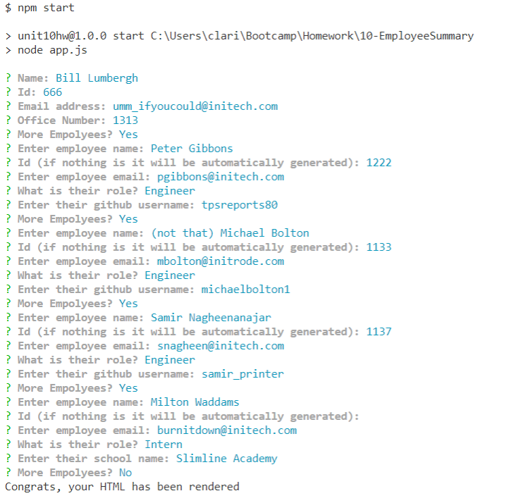
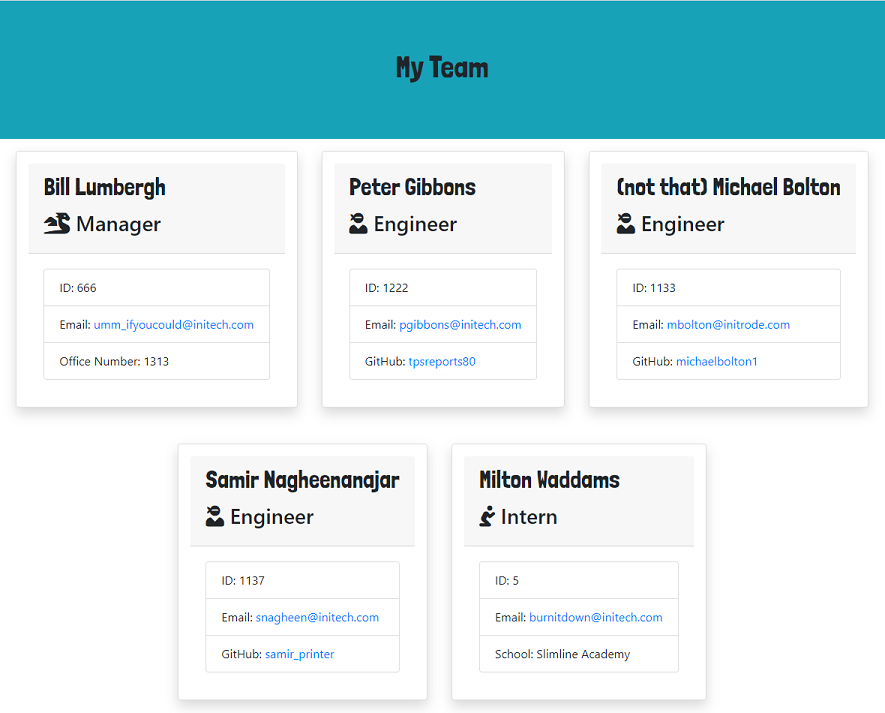

# Employee Summary Template

  

## Description

A Command-Line Interface utilizing Inquirer JS, to generate the HTML for an Employee Summary.

Link to [video demonstrating functionality](https://drive.google.com/file/d/1vwA3lJzRtbrdCZ8YK7A5tWHsFryGezpE/view?usp=sharing).

## Table of Contents

* [Installation](#installation)
* [Usage](#usage)
* [Contributing](#contributing)
* [Tests](#tests)
* [License](#license)
* [Questions](#questions)

## Installation

Run `npm init` to install dependencies.

## Usage

Application is invoked with command: `node app.js` or `npm start`.

## License

MIT License

Copyright (c) 2020 Clarissa Reeve

## Contributing

When contributing to this repository, please first discuss the change you wish to make via issue, email, or any other method with the owner(s) of this repository before making a change.

## Tests

The tests are included in the 'test' folder, and can be invoked with `npm test`.

## Questions

For any questions the author can be contacted at:

GitHub: @[clarissareeve](https://github.com/clarissareeve)

Email: clarissa.reeve@gmail.com
